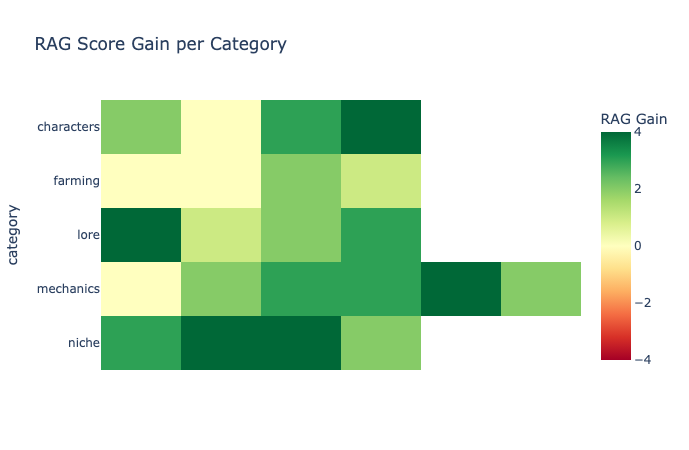
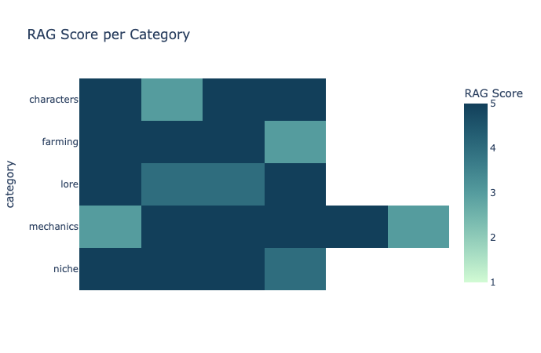

# TalkToWiki

Ask questions about Stardew Valley and get answers based on the wiki.

**[LIVE DEMO](https://talk-to-wiki.klets.dev/)**

## Highlights

- Custom data pipeline: wiki HTML -> markdown -> semantic chunks -> vector embeddings (Special handling for complex wiki tables with nested structure.)
- Custom evaluations with LLM as judge scoring to compare where RAG helped and what was known by the model before
- RAG achieves **4.50/5** average accuracy vs **2.27/5** baseline

## Evaluation & Results

22 Q&A pairs across 5 categories (characters, farming, lore, mechanics, niche), each scored 1–5 by an LLM judge. RAG answers are compared against the same model (gpt 5 nano) answering without any context.

**Scores:**  
5 = Fully correct AND equally or more specific than the reference answer  
4 = Correct and useful, but less specific (e.g. "in the mines" when the
reference says "levels 40-79 of the mines") - no wrong information  
3 = Partially correct — gets the gist but missing important details,
or correct on some points but wrong on others  
2 = Mostly wrong, but contains a grain of relevant truth  
1 = Completely wrong, irrelevant, or nonsensical

|                   | Non-RAG | RAG  |
| ----------------- | ------- | ---- |
| **Average score** | 2.27    | 4.50 |

The biggest gains are in the niche category, which is to be expected. Interesting that the base model without RAG gets a lot of the farming and mechanics questions correct when it doesn't outright refuse to answer claiming "such thing does not exist in the game".  
The RAG still struggles with gifting questions, which are hard to get right because info is often scattered between multiple huge tables and not all of them are retrieved in full. Some one-off questions also got lower scores because they consisted of 2 somewhat relevant subquestions but the retrieved documents touched only on 1 part and the second one got lost. (that's something to fix in the benchmark itself or split questions of that form into multiple parts before retrieval)

### RAG score gain by category



### RAG scores by category



## Setup

**Requirements:** Python 3.13, uv, Node.js, a Supabase project with pgvector, OpenAI API key

**Environment variables** (`.env`):

```
SUPABASE_URL=
SUPABASE_KEY=
OPENAI_API_KEY=
LOGFIRE_TOKEN=         # optional, for observability
ALLOWED_ORIGINS=       # comma-separated, defaults to http://localhost:3000
NEXT_PUBLIC_API_URL=   # FastAPI base URL for the frontend
```

**Run the API:**

```bash
cd api && uv run fastapi dev
```

**Run the frontend:**

```bash
cd web && npm install && npm run dev
```

## Project Structure

```
ingestion/
  fetch.py          # Wiki API to raw JSON
  process.py        # HTML to Markdown (handles complex wiki tables)
  chunk.py          # Markdown -> chunks -> embeddings, saved to Supabase

api/
  main.py           # FastAPI: get top 5 documents by cosine similarity and respond to question

eval/
  eval.py           # RAG vs non-RAG evaluation
  questions.json    # Ground truth Q&A pairs
  analysis.ipynb    # Comparison and some interactive visualisations
  outputs/          # Scored results (v3)

web/                # Next.js chat UI
```

## Future Improvements

- Streaming responses
- Multi-turn conversation memory
- Retrieval-specific eval metrics
- Bigger eval set (at least have an even number of questions in each category)
- Decide how to handle multi-part questions for better performance

## License

Code is MIT licensed. Wiki-derived data falls under [CC BY-NC-SA 3.0](https://creativecommons.org/licenses/by-nc-sa/3.0/) per stardewvalleywiki.com requirements.

---

Have feedback or comments to this project? Feel free to contact me :D
